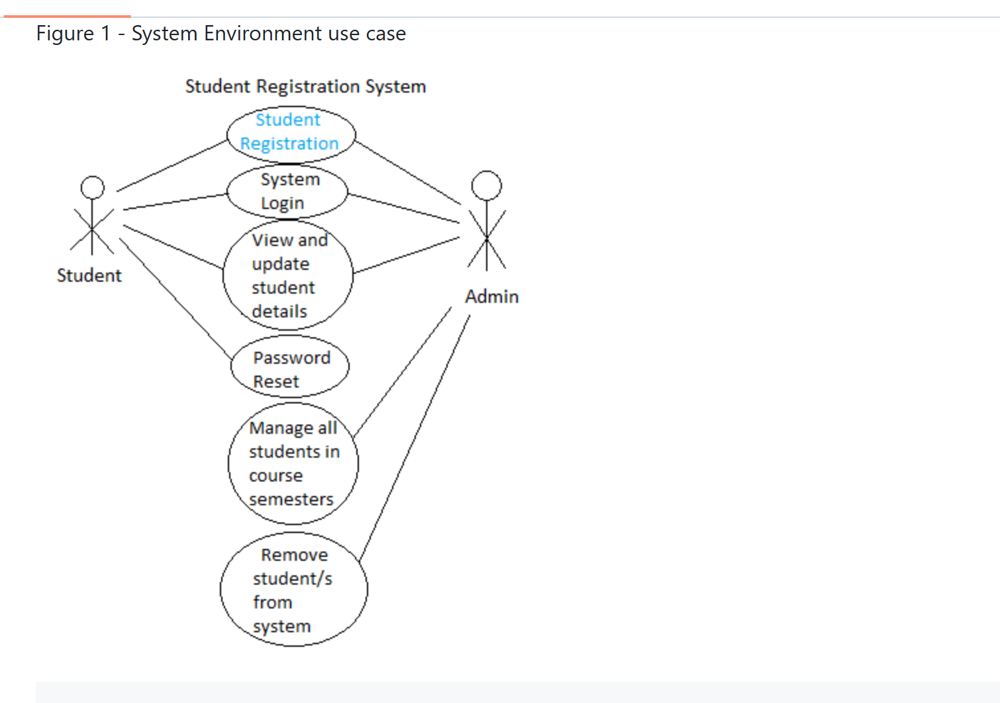
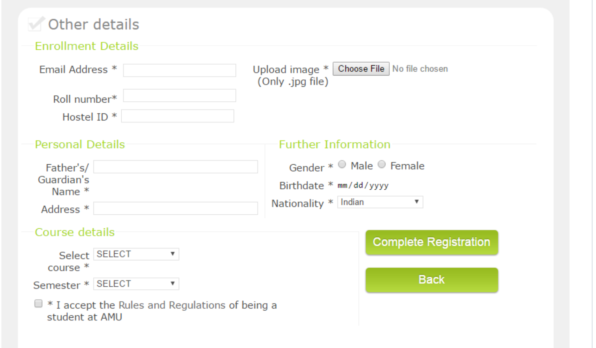
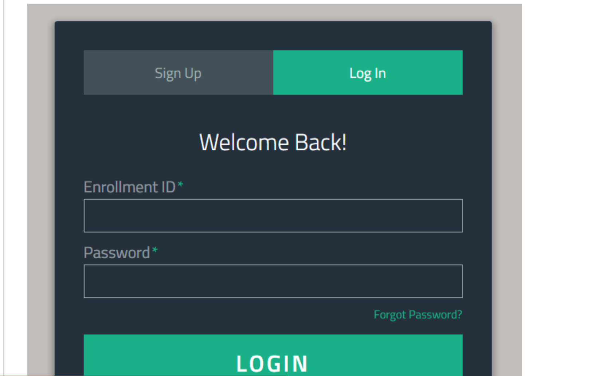
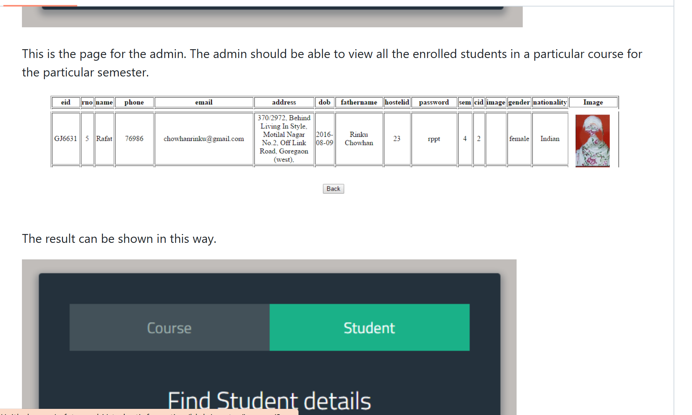
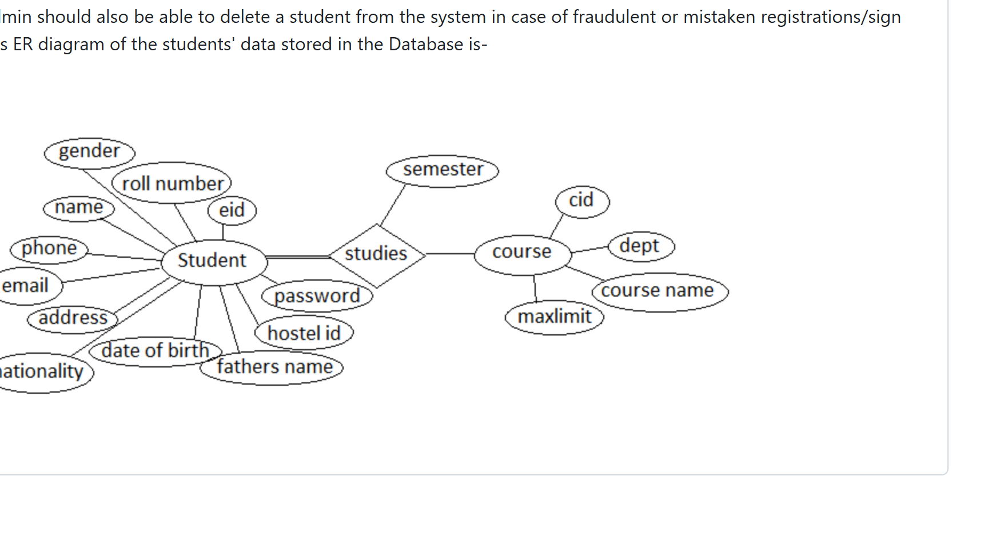
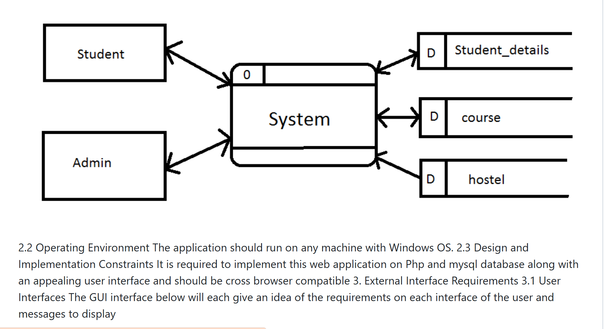

# Student Information Portal

This is a **Student Registration and Information System** using PHP and MySQL.

This web-based application allows students to register for semesters, view and edit their details. The administrator can view all students, update information, and manage courses.  

---

## Features

- Student registration and profile management
- Admin can add, edit, and delete student records
- Course management
- PDF generation of student details
- Search and filter students by year, course, gender, etc.
- Export student lists to Excel

---

## Installation

1. Install [XAMPP](https://www.apachefriends.org/download.html) on your PC.
2. Start **Apache** and **MySQL** from XAMPP Control Panel.
3. Copy the project folder (`studentinformation-master`) into `C:\xampp\htdocs\`.
4. Open **phpMyAdmin** (`http://localhost/phpmyadmin`) and create a database named `student`.
5. Import the provided `.sql` file into the database.
6. Open the project in a browser: `http://localhost/studentinformation-master/`
7. Student login example:
   - Enrollment ID: `GH1234`
   - Password: `12345678`
8. Admin login example:
   - Username: `0000`
   - Password: `amu_reg`

---

## Screenshots

**Home Page / Registration Form**  

**Student Details Form**  

**Registration Confirmation (PDF)**  

**Student Login**  

**Student Dashboard**  

**Admin Dashboard**  

**Admin Search Student**  

**Admin Add/Delete Student**  

---

## Database Structure

- **student_details** – stores student personal and course details
- **course** – stores course information
- **hostel** – stores hostel details
- **admin** – stores admin login credentials

**ER Diagram**  

---

## Author

**Bhagyashree N**  
Email: bhagyashree3598@gmail.com
